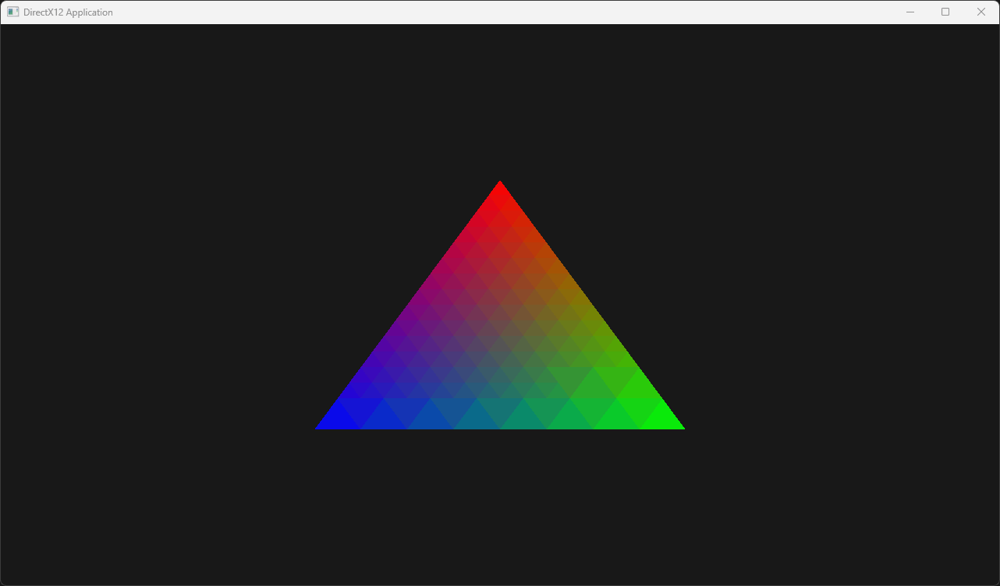

# D3D12Engine

Initializing the graphics pipeline and drawing the Triangle primitive

  

## Peculiarities
- **API** `DirectX 12`
- **Language** `C++20`
- **Building System** `CMake`
- **Application Architecture** The window is implemented through the standard library `Windows.h`, graphics are drawn independently within the window

## Launch
1. Clone Git repository
2. Run `PreView.ps1` script
3. Enjoy :D

## Useful links
- Great [theory](https://petitl.fr/articles/creating-a-directx12-3d-engine-when-you-know-nothing#the-graphics-pipeline) - methods, logic, and architecture are described in detail
- A wonderful [course](https://www.braynzarsoft.net/viewtutorial/q16390-04-directx-12-braynzar-soft-tutorials), quite complete and detailed. It also provides open source code that you can run and see how it works in practice

## References
1. https://github.com/CanYouCatchMe01/DirectX12Model3D
2. https://github.com/PardCode
3. https://github.com/7RosenRot/DirectX12Engine-old
