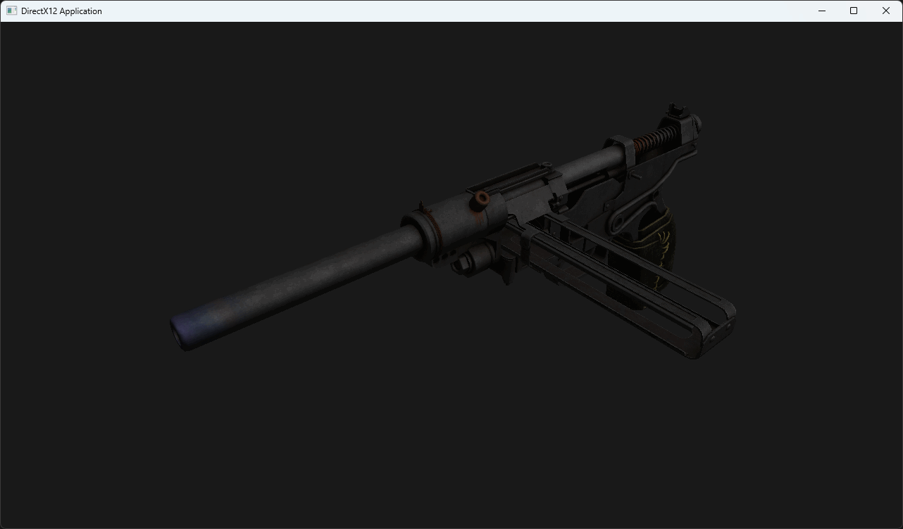

# D3D12Engine - 3D Engine, supports loading and rendering 3D objects and base color textures. Uses default lighting.

<<<<<<< HEAD
Available now...

=======
>>>>>>> da09467a8f21fb38b8db48f0ac6fafb08dcfc792
<p align="center">
  
</p>


## Peculiarities
- **API** `DirectX 12`
- **Language** `C++20`
- **Building System** `CMake`
- **Application Architecture** The window is implemented through the standard library `Windows.h`, graphics are drawn independently within the window

## Launch
1. Clone Git repository
```bash
git clone https://github.com/7RosenRot/DirectX12Engine.git

git checkout develop
```
2. Build the application
```bash
cmake -S . -B build

cmake --build build --parallel --config=Release
```
3. Enjoy :D
```bash
./build/Release/Render.exe
```

## Engine Tree

Engine/
- Assets/           ← Assets
- - Models/
- - Resource/
- - Shaders/

- Source/           ← Source Code
- - Application/            ← Layer 4
- - - Window/
- - - Input/
- - - Kernel/

- - Framework/              ← Layer 3
- - - Camera/
- - - Transform/
- - - GameObject/

- - Renderer/               ← Layer 2
- - - IRenderer/
- - - D3D12Engine/
- - - - Model/
- - - - Texture/
- - - - Backend/
- - - - - DirectX12Graphics/
- - - - - RHI/              ← Layer 1
- - - - - - Core/
- - - - - - - CommandContext/
- - - - - - - GraphicsCore/
- - - - - - Pipeline/
- - - - - - - CommandQueue/
- - - - - - - SwapChain/
- - - - - - - PipelineState/
- - - - - - - RootSignature/
- - - - - - Resources/
- - - - - - - BackBuffer/
- - - - - - - DepthBuffer/
- - - - - - - GpuBuffer/
- - - - - - - GpuResource/
- - - - - - Libraries/

- - main.cpp

- CMakeLists.txt

CMakeLists.txt

### Architecture Layers

#### Layer 4: Application/
* **Responsibility**: Window creation, input handling (listening to window events), and orchestration of lower abstraction layers.
* **Key Note**: Kept as close to the native Operating System (OS) level as possible.

#### Layer 3: Framework/
* **Responsibility**: Camera creation and management, game object lifecycle handling (storing arrays of models), and leveraging the graphics API backend.
* **Key Note**: Acts as the boundary layer between the UI/Engine Application logic and the core Graphics API.

#### Layer 2: D3D12Engine/
* **Responsibility**: Orchestrates low-level graphics subsystems, aggregates raw API components, and fetches the final rendering results.
* **Key Note**: Purely graphics-oriented. It has zero knowledge of scene context, camera properties, or game object counts.

#### Layer 1: Graphics/ (RHI / Hardware Interface)
* **Responsibility**: Handles direct GPU memory allocation, resource binding, and populating low-level pipelines with vertex and index data.
* **Key Note**: The lowest abstraction level. Responsible for hardware interaction, memory heaps management, and core pipeline state setup.

## Inspired by
- Microsoft [mini engine](https://github.com/microsoft/DirectX-Graphics-Samples?tab=readme-ov-file) - full implementatioin, real DirectX12 engine

## Useful links
- Great [theory](https://petitl.fr/articles/creating-a-directx12-3d-engine-when-you-know-nothing#the-graphics-pipeline) - methods, logic, and architecture are described in detail
- A wonderful [course](https://www.braynzarsoft.net/viewtutorial/q16390-04-directx-12-braynzar-soft-tutorials), quite complete and detailed. It also provides open source code that you can run and see how it works in practice
